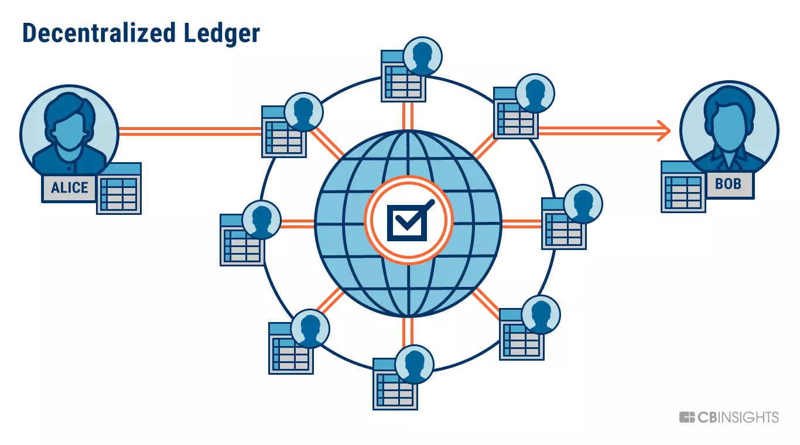
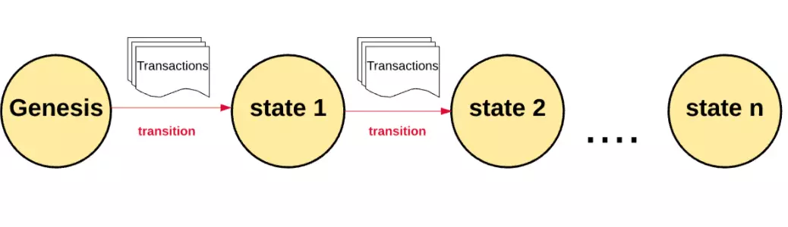
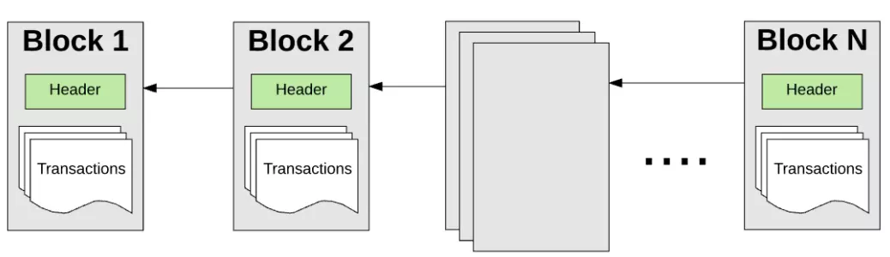

# Level 1 - What is Blockchain?

A blockchain is a shared, distributed, and permanent database shared among multiple nodes on a computer network. They record data in a way that makes it probabilistically impossible to modify or hack the system.

Specifically, as its namesake, blockchains record data as a chain of blocks. Each block contains a group of transactions, which could be transferring assets around the network, or updating the information stored on the blockchain.

Blockchains were popularized by the anonymous person (or group) Satoshi Nakamoto, when they released the [Bitcoin Network](https://bitcoin.org) in 2008. Bitcoin is a cryptocurrency network, and it handles primarily the transfer of the BTC asset across the network, without a trusted middleman or authority, while ensuring the network itself is secure and cannot be hacked. (P.S. The bitcoin network is also likely the biggest bug bounty in the world - if you can hack it, you're an instant trillionaire).

Over time, this design of Bitcoin inspired other, more capable, blockchain networks to come out, like [Ethereum](https://ethereum.org). We will be learning a lot about Ethereum in the coming sessions.

### State Management

Blockchains start off with a Genesis State when they launch. Bitcoin's genesis state happened in 2009 when the public network launched. Ethereum's Genesis State happened in 2015, when it launched.

Every transaction on a blockchain modifies the global state that is replicated across all nodes.

Since there are millions of transactions, transactions get grouped together in blocks. Hence the name. These blocks are chained together in a cryptographically verifiable way so they are historically traceable. The current state of a network can be recalculated at any time by starting from the genesis block and transitioning the state according to each block's information up until now.

### Nodes

A blockchain network is managed autonomously through a [peer-to-peer](https://en.wikipedia.org/wiki/Peer-to-peer) distributed network of computer nodes. Without going into too much detail, you can simply think of each node in the network as keeping a copy of the global transaction ledger. Therefore, each node can individually verify and audit transactions happening on the network and ensure there was no illicit behaviour.
Another type of node, called a [mining node](https://en.wikipedia.org/wiki/Bitcoin#Mining), is responsible for grouping together new transactions being made on a network into a block, and proposing the block to be included onto the global ledger by everyone else. Mining is computationally hard, and very important to do securely, so miners whose blocks get accepted are given a token reward for their hard work.

The use of a blockchain confirms that each unit of value was transfered only once, and the ingenious mechanisms put forth by Satoshi Nakamoto solved the long-standing decentralized [double-spending](https://en.wikipedia.org/wiki/Double-spending) problem.

### Decentralization

By storing data in a peer to peer network of nodes, the blockchain is a decentralized network. This has significant benefits over the traditional approach of storing data in a centralized manner. There are significant examples of problems with centralization - a few of which we will list here:

- Data breaches in centralized systems expose lot of data
- Centralized authorities can censor and shut down speech
- Reliance on a central authority means upstream problems affect downstream consumers (e.g. AWS going down means most of the internet goes down with it)

On the other hand, decentralization brings about the opposite benefits.

- No censorship as there is no single authority or middleman that can censor you
- No downtime as the overall network is running across 1000's of nodes across the globe
- Highly attack resistant making it infeasible to manipulate or destroy data

### Use Cases

- Cryptocurrency
- Smart Contracts
- Decentralized Finance
- Gaming
- Supply Chain Tracking
- Counterfeiting Protection
- Data Privacy
- Decentralized Governance
- Verifiable ownership of assets

and many more...

### Resources

To learn more about blockchains, we highly suggest the following resources:

#### Must Watch

- [But how does bitcoin actually work? by 3Blue1Brown](https://www.youtube.com/watch?v=bBC-nXj3Ng4)
- [Blockchain Demo by Anders Brownworth](https://andersbrownworth.com/blockchain)

#### Recommended

- [A Gentle Introduction to Blockchain Technology by Bits On Blocks](https://bitsonblocks.net/2015/09/09/gentle-introduction-blockchain-technology/)
- [How does a blockchain work by Simply Explained](https://www.youtube.com/watch?v=SSo_EIwHSd4)
