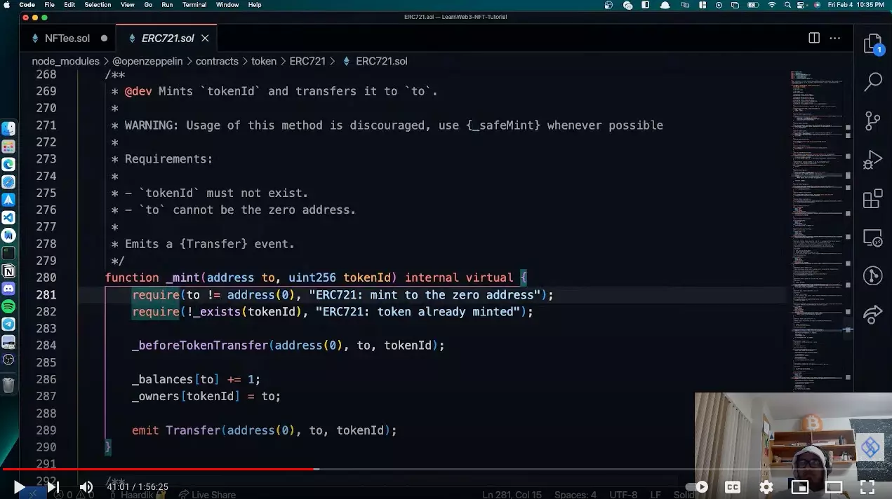

# Level 9 - NFT-Tutorial

### Forked from https://github.com/BlockDevsUnited/NFT-Tutorial

Deploy a NFT project on Ethereum

## Prefer a Video?

If you would rather learn from a video, we have a recording available of this tutorial on our YouTube. Watch the video by clicking on the screenshot below, or go ahead and read the tutorial!

[](https://www.youtube.com/watch?v=uwnAXAsd428 "NFT Tutorial")

## Prerequisites

- Set up a Metamask (Beginner Track - [Level-4](https://github.com/LearnWeb3DAO/Crypto-Wallets))
- Check if your computer has Node.js. If not download from [here](https://nodejs.org/en/download/)

---

## Build

### Smart Contract

To build the smart contract we would be using [Hardhat](https://hardhat.org/).
Hardhat is an Ethereum development environment and framework designed for full stack development. In simple words you can write your smart contract, deploy them, run tests, and debug your code.

- To setup a Hardhat project, Open up a terminal and execute these commands

  ```bash
  mkdir NFT-Tutorial
  cd  NFT-Tutorial
  npm init --yes
  npm install --save-dev hardhat
  ```

- In the same directory where you installed Hardhat run:

  ```bash
  npx hardhat
  ```

  - Select `Create a basic sample project`
  - Press enter for the already specified `Hardhat Project root`
  - Press enter for the question on if you want to add a `.gitignore`
  - Press enter for `Do you want to install this sample project's dependencies with npm (@nomiclabs/hardhat-waffle ethereum-waffle chai @nomiclabs/hardhat-ethers ethers)?`

Now you have a hardhat project ready to go!

If you are not on mac, please do this extra step and install these libraries as well :)

```bash
npm install --save-dev @nomiclabs/hardhat-waffle ethereum-waffle chai @nomiclabs/hardhat-ethers ethers
```

---

## Write NFT Contract Code

Lets install Open Zeppelin contracts, In the terminal window execute this command

```
npm install @openzeppelin/contracts
```

- In the contracts folder, create a new solidity file called NFTee.sol
- Now we would write some code in the NFTee.sol file. We would be importing [Openzeppelin's ERC721 Contract](https://github.com/OpenZeppelin/openzeppelin-contracts/blob/master/contracts/token/ERC721/ERC721.sol). ERC721 is the most common standard for creating NFT's. In the freshman track, we would only be using ERC721. In the sophomore track, you would learn more about ERC721's in detail. So dont worry, if you dont understand everything :)

```js
// SPDX-License-Identifier: MIT
pragma solidity ^0.8.0;

// Import the openzepplin contracts
import "@openzeppelin/contracts/token/ERC721/ERC721.sol";

// GameItem is  ERC721 signifies that the contract we are creating imports ERC721 and follows ERC721 contract from openzeppelin
contract GameItem is ERC721 {

    constructor() ERC721("GameItem", "ITM") {
        // mint an NFT to yourself
        _mint(msg.sender, 1);
    }
}
```

- Compile the contract, open up a terminal and execute these commands

```bash
npx hardhat compile
```

If there are no errors, you are good to go :)

## Configuring Deployment

- Lets deploy the contract to `rinkeby` network. First, create a new file named `deploy.js` under `scripts` folder

- Now we would write some code to deploy the contract in `deploy.js` file.

```js
// Import ethers from Hardhat package
const { ethers } = require("hardhat");

async function main() {
  /*
A ContractFactory in ethers.js is an abstraction used to deploy new smart contracts,
so nftContract here is a factory for instances of our GameItem contract.
*/
  const nftContract = await ethers.getContractFactory("GameItem");

  // here we deploy the contract
  const deployedNFTContract = await nftContract.deploy();

  // print the address of the deployed contract
  console.log("NFT Contract Address:", deployedNFTContract.address);
}

// Call the main function and catch if there is any error
main()
  .then(() => process.exit(0))
  .catch((error) => {
    console.error(error);
    process.exit(1);
  });
```

- Now create a `.env` file in the `NFT-Tutorial` folder and add the following lines. Use the instructions in the comments to get your Alchemy API Key and RINKEBY Private Key. Make sure that the account from which you get your rinkeby private key is funded with Rinkeby Ether.You can get some here: [https://www.rinkebyfaucet.com/](https://www.rinkebyfaucet.com/)

```

// Go to https://www.alchemyapi.io, sign up, create
// a new App in its dashboard and select the network as Rinkeby, and replace "add-the-alchemy-key-url-here" with its key url
ALCHEMY_API_KEY_URL="add-the-alchemy-key-url-here"

// Replace this private key with your RINKEBY account private key
// To export your private key from Metamask, open Metamask and
// go to Account Details > Export Private Key
// Be aware of NEVER putting real Ether into testing accounts
RINKEBY_PRIVATE_KEY="add-the-rinkeby-private-key-here"

```

You can think of Alchemy as AWS EC2 for blockchain. It is a node provider. It helps us to connect with the blockchain by providing us with nodes so that we can read and write to the blockchain. Alchemy is what helps us deploy the contract to rinkeby.

- Now we would install `dotenv` package to be able to import the env file and use it in our config.
  In your terminal, execute these commands.
  ```bash
  npm install dotenv
  ```
- Now open the hardhat.config.js file, we would add the `rinkeby` network here so that we can deploy our contract to rinkeby. Replace all the lines in the `hardhat.config.js` file with the given below lines

```js
require("@nomiclabs/hardhat-waffle");
require("dotenv").config({ path: ".env" });

const ALCHEMY_API_KEY_URL = process.env.ALCHEMY_API_KEY_URL;

const RINKEBY_PRIVATE_KEY = process.env.RINKEBY_PRIVATE_KEY;

module.exports = {
  solidity: "0.8.4",
  networks: {
    rinkeby: {
      url: ALCHEMY_API_KEY_URL,
      accounts: [RINKEBY_PRIVATE_KEY],
    },
  },
};
```

- To deploy in your terminal type:
  ```bash
      npx hardhat run scripts/deploy.js --network rinkeby
  ```
- Save the NFT Contract Address that was printed on your terminal in your notepad, you would need it.

## Verify on Etherscan

- Go to [Rinkeby Etherscan](https://rinkeby.etherscan.io/) and search for the address that was printed.
- If the `address` opens up on etherscan, you have deployed your first NFT 🎉
- Go to the transaction details by clicking on the transaction hash, check that there was a token transfered to your address
